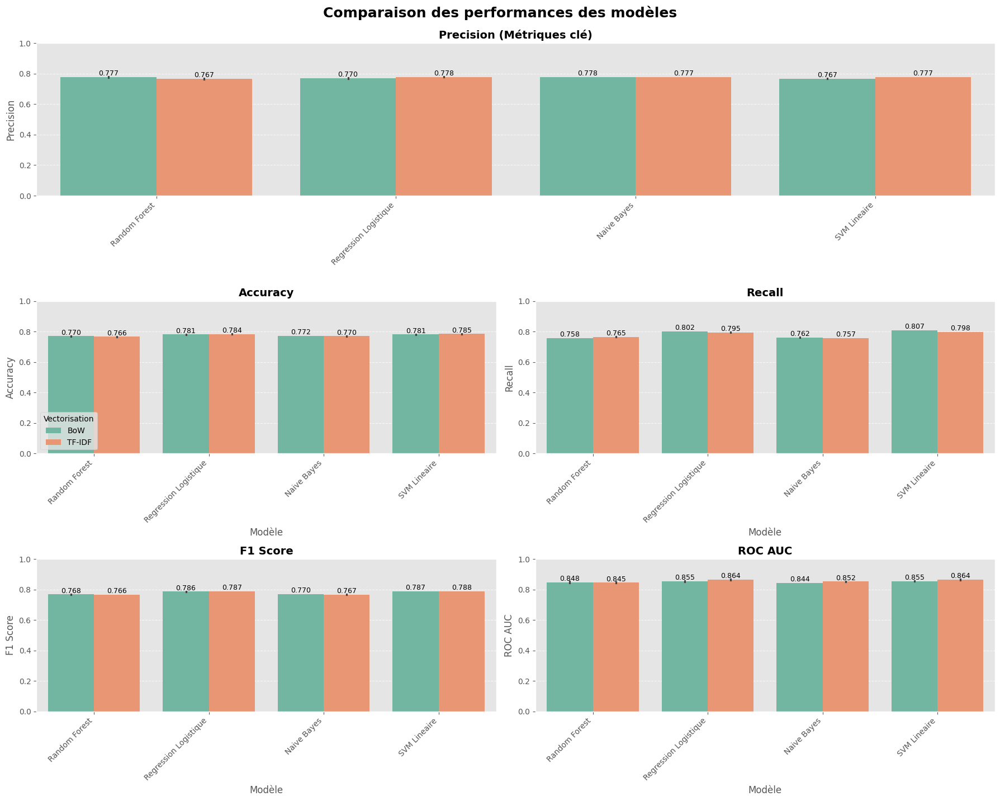
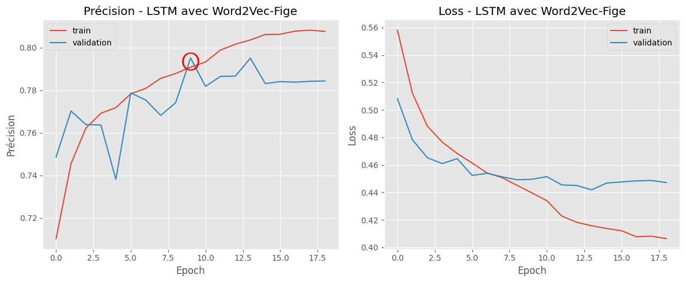
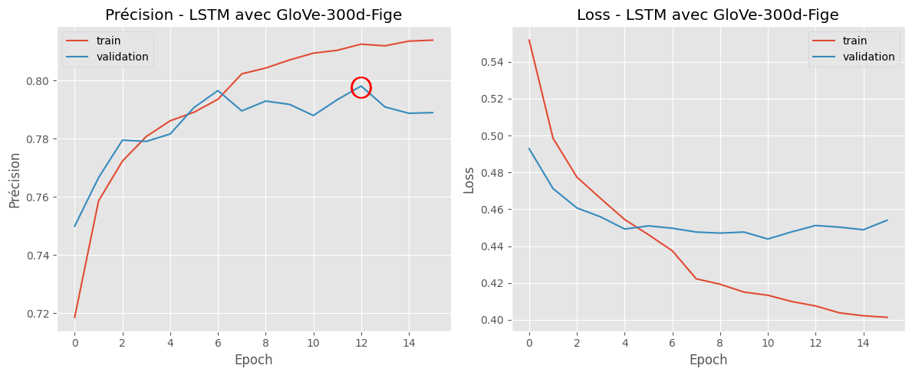
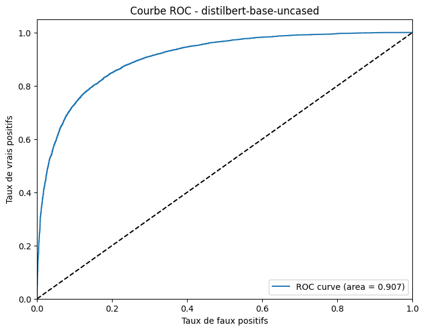
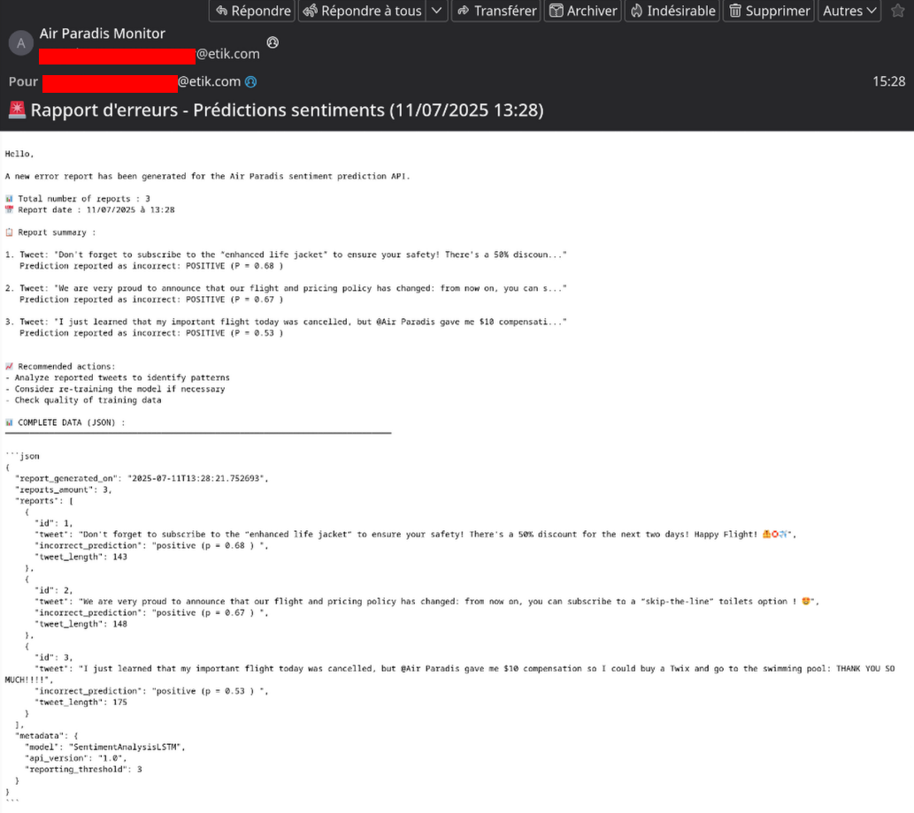
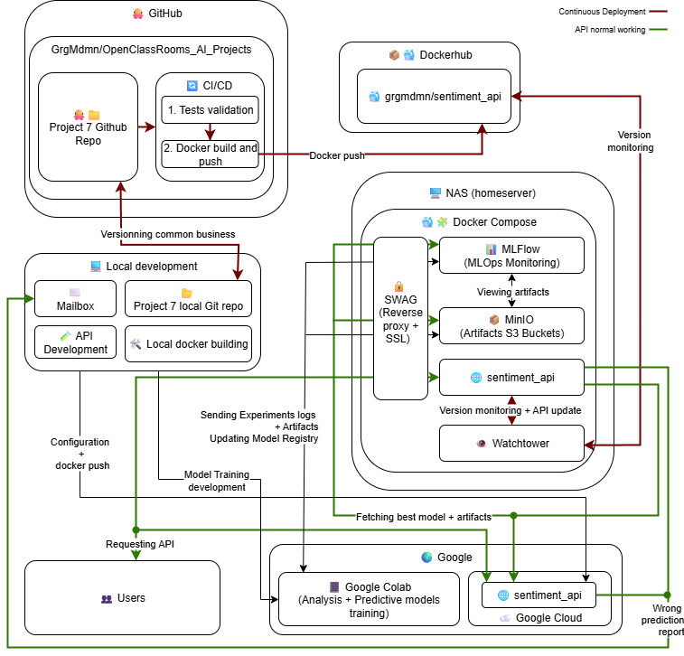

# ✨ Analyse de sentiments et déploiement MLOps : retour d’expérience complet

Dans le cadre du projet *Air Paradis*, nous avons mis en œuvre une chaîne complète d’analyse de sentiments à partir de tweets, depuis la modélisation jusqu’au déploiement MLOps. Ce billet de blog revient sur les étapes clés du projet : choix méthodologiques, comparaison des modèles, mise en production d’une API robuste, et déploiement sur deux environnements (local + cloud). 🧠🔧

---

## 🔍 Trois approches de modélisation supervisée

Nous avons testé trois approches complémentaires pour prédire le sentiment d’un tweet. Chacune repose sur une représentation textuelle différente et un algorithme d’apprentissage adapté :

### 1. 🧱 Approche simple : Bag-of-Words (BoW) + modèles de machine learning

On vectorise les tweets via BoW ou BoW + TF-IDF, qui comptent la fréquence des mots.  
Contrairement à d'autres projets NLP, nous avons évité LDA (non supervisé, orienté topic modeling).

➡️ **Modèles testés** :
- Régression Logistique  
- Naive Bayes  
- SVM  
- Random Forest  

Ces modèles sont entraînés avec **GridSearchCV**, en optimisant la **précision (`precision`)**, notre KPI métier. Différents KPI ont été calculés sur l'ensemble de test.



---

### 2. 🔥 Approche avancée : Word Embeddings + LSTM

Nous utilisons des vecteurs denses Word2Vec (entraînés) et GloVe 300d (préentraînés par Stanford), qui capturent les similarités sémantiques entre mots. Ces représentations ne prennent toutefois **pas en compte le contexte** exact (ex : "annulé" est probablement un mot très négatif pour un vol mais positif pour un procès contenant des charges contre vous).

La classification est réalisée par un **LSTM**, capable d'exploiter la séquentialité des mots.  
Le **modèle déployé est automatiquement sélectionné** entre Word2Vec + LSTM et GloVe + LSTM, selon la **précision maximale enregistrée dans MLFlow**.

Modèle `Word2Vec + LSTM` (`test_precision : 0.797 , val_precision : 0.795`):

Modèle `GloVe 300d + LSTM` (`test_precision : 0.792 , val_precision : 0.798`):


Bien que GloVe 300d + LSTM présente un score de précision légèrement supérieur à Word2Vec + LSTM sur l'ensemble de validation, il reste inférieur pour l'ensemble de test (relativement négligeable dans l'absolu).

---

### 3. 🤖 Approche transformer : DistilBERT, embeddings contextuels allégés

Nous avons utilisé **DistilBERT**, une version plus légère et plus rapide de BERT (créée par Hugging Face).  
Il conserve **95 % de la performance de BERT** tout en étant **40 % plus petit** et **60 % plus rapide**, ce qui le rend particulièrement adapté à un **entraînement sur GPU limité** (Google Colab) et à une **inférence plus rapide**.

Comme BERT, DistilBERT produit des **embeddings contextuels**, c’est-à-dire que le sens des mots varie selon leur contexte. Par exemple, *"banque"* dans *"je vais à la banque"* et *"banque de données"* n’aura pas le même vecteur.

Il a été **fine-tuné** ici pour une classification binaire (positif/négatif), avec un tokenizer et un encodage spécifiques à son architecture.

> **Modèle `DistilBERT`** (`test_precision : 0.861 , val_precision : 0.858`)

  
  


⚠️ **Limites** : comme tous les modèles préentraînés, DistilBERT **n’est pas sensible à l’ironie, aux jeux de mots, ni aux références culturelles implicites**.  
Or, Twitter est un terrain de jeu idéal pour ce genre de contenus détournés. Ces limites s’appliquent aussi à Word2Vec, GloVe et aux modèles classiques.

---

## 🎯 Pourquoi optimiser la précision (et non l'accuracy) ?

**Accuracy** = proportion de bonnes prédictions globales.  
**Precision** = proportion de tweets *prévus positifs* qui sont *vraiment positifs*.

> Exemple : sur 100 tweets, si le modèle prédit 30 positifs, mais 15 sont des erreurs, la précision est de 50 %.

Nous avons préféré **minimiser les faux positifs**, car dans un contexte sensible, **annoncer un tweet positif alors qu’il est négatif peut être problématique**.

- Modèles classiques : **GridSearchCV optimisé sur la précision**  
- Modèles DL : **EarlyStopping sur val_loss**, mais **sélection finale sur la précision**

---

## ⚙️ Environnement MLOps souverain

### 🖥️ Serveur personnel NAS + OpenMediaVault

MLFlow est installé sur un **NAS personnel (Intel N100)**, sous **OpenMediaVault (Debian)**.  
Nous utilisons **MinIO** pour stocker artefacts et modèles, garantissant une gestion locale, souveraine et compatible S3.

> Les notebooks, exécutés sur Google Colab pour bénéficier de GPU, loggent dans MLFlow et envoient les modèles vers MinIO via des **variables d’environnement**.

Dashboard Expériences MLFlow :


Modèles en production (registre de modèles):


Meilleur modèle non BERT retenu :


---

## 🧪 CI, tests et versioning

### ✅ Tests unitaires

- Vérifient le bon fonctionnement du prétraitement, des prédictions et de la gestion d’erreurs.
- Intégrés à **GitHub Actions**, **ils bloquent le déploiement si les tests échouent.**

### 🐳 Conteneurisation & CI/CD

L’API FastAPI est packagée via Docker, puis poussée sur DockerHub.  
Un [pipeline CI/CD](https://github.com/GrgMdmn/OpenClassrooms_AI_Projects/blob/main/.github/workflows/p7_ci-cd.yml) complet garantit **un déploiement reproductible**. Il assure:
- La validation de tests unitaires
- La construction et le push de l'api conteneurisée sur dockerhub


---

## 🚀 Déploiement de l’API FastAPI (double)

### 🔧 Backend : FastAPI

- Expose un endpoint `/predict`  
- Charge dynamiquement le **meilleur modèle Word Embedding + LSTM** via le *Model Registry* MLFlow  
- Applique les bons embeddings selon le tag `embedding_type`

### 💻 Interface Streamlit

Interface locale pour tester les requêtes, debug, démonstrations.


---

### 🌐 Double déploiement (NAS + Google Cloud)

#### 🔧 Problème AVX2

Initialement, l’API ne fonctionnait pas sur le NAS (processeur Intel N100), car celui-ci ne prenait pas en charge les instructions **AVX2**, requises par TensorFlow.

> 🛠️ **Solution** : activation manuelle du support AVX2 dans le BIOS. Cette option est souvent désactivée par défaut sur les cartes mères orientées NAS pour des raisons de consommation énergétique ou de stabilité.

Depuis cette modification, le NAS peut exécuter l’API sans erreurs.

---

#### 🚀 API déployées

Le projet propose un **double déploiement** de l’API, en local et dans le cloud :

- 🏠 **NAS local** : [sentiment-api.greg-madman-nas.duckdns.org](https://sentiment-api.greg-madman-nas.duckdns.org)\
Interface Docker Compose sur le NAS :


- ☁️ **Google Cloud Run** : [sentiment-api-service-7772256003.europe-west1.run.app](https://sentiment-api-service-7772256003.europe-west1.run.app)\
Interface de déploiement Google Cloud :


---

#### 🔄 Déploiement continu automatisé (NAS uniquement)

Pour assurer un **déploiement continu** sur le NAS, il a été choisi d'installer [**Watchtower**](https://containrrr.dev/watchtower/arguments/) pour rester dans un logique d'environnement 100% `docker`. Cet outil surveille toutes les **10 minutes** l’image Docker de l’API (`sentiment_api`) et, en cas de nouvelle version disponible sur DockerHub, redémarre automatiquement le conteneur avec la dernière image.


> Un **système d’alerte mail** notifie automatiquement toute mise à jour effectuée.


Ce mécanisme garantit que la version déployée sur le NAS reste toujours synchronisée avec la dernière version validée par les tests sur GitHub Actions, **sans intervention manuelle**.


---

## 📊 Monitoring maison

Une logique d’alerte légère embarquée dans l’API :


Si **3 erreurs de prédiction** consécutives sont détectées sur une **fenêtre de 5 min**, un rapport est généré automatiquement.




---

## 🧠 Schéma global du pipeline MLOps

### Schéma synthétique
```
     ┌────────────┐
     │  Données   │
     │ (tweets)   │
     └─────┬──────┘
           │
    Prétraitement (regex, tokenisation, lemmatisation, stopwords)
           │
 ┌─────────▼──────────┐
 │  Entraînement ML   │
 └─────────┬──────────┘
           │
    Log via MLFlow + artefacts MinIO
           │
 Sélection du meilleur modèle "avancé" (hors BERT) selon précision
           │
 ┌─────────▼──────────┐
 │    API FastAPI     │
 │    + Streamlit     │
 └─────────┬──────────┘
           │
 Déploiement :
   ├─ Google Cloud Run (manuel)
   └─ NAS local (automatisé via Watchtower)
           │
┌──────────▼─────────────┐
│ Monitoring léger maison│
│ (alertes sur mauvaises │
│       prédictions)     │
└────────────────────────┘
```
### Schéma détaillé


---

## ✨ Conclusion

Ce projet démontre comment construire une chaîne MLOps complète, autonome et reproductible pour du NLP appliqué à Twitter.  
Il souligne les **forces et limites des modèles** (y compris BERT), la nécessité d’une métrique adaptée au contexte (précision vs accuracy), et l’importance d’un **déploiement maîtrisé**, même sur une infrastructure personnelle.

---

💬 Merci pour votre lecture !