# ✨ Analyse de sentiments et déploiement MLOps : retour d’expérience complet

Dans le cadre du projet *Air Paradis*, nous avons mis en œuvre une chaîne complète d’analyse de sentiments à partir de tweets, depuis la modélisation jusqu’au déploiement MLOps. Ce billet de blog revient sur les étapes clés du projet : choix méthodologiques, comparaison des modèles, mise en production d’une API robuste, et déploiement sur deux environnements (local + cloud). 🧠🔧

---

## 🔍 Trois approches de modélisation supervisée

Nous avons testé trois approches complémentaires pour prédire le sentiment d’un tweet. Chacune repose sur une représentation textuelle différente et un algorithme d’apprentissage adapté :

### 1. 🧱 Approche simple : Bag-of-Words (BoW) + modèles de machine learning

On vectorise les tweets via BoW ou BoW + TF-IDF, qui comptent la fréquence des mots.  
Contrairement à d'autres projets NLP, nous avons évité LDA (non supervisé, orienté topic modeling).

➡️ **Modèles testés** :
- Régression Logistique  
- Naive Bayes  
- SVM  
- Random Forest  

Ces modèles sont entraînés avec **GridSearchCV**, en optimisant la **précision (`precision`)**, notre KPI métier. Différents KPI ont été calculés sur l'ensemble de test.

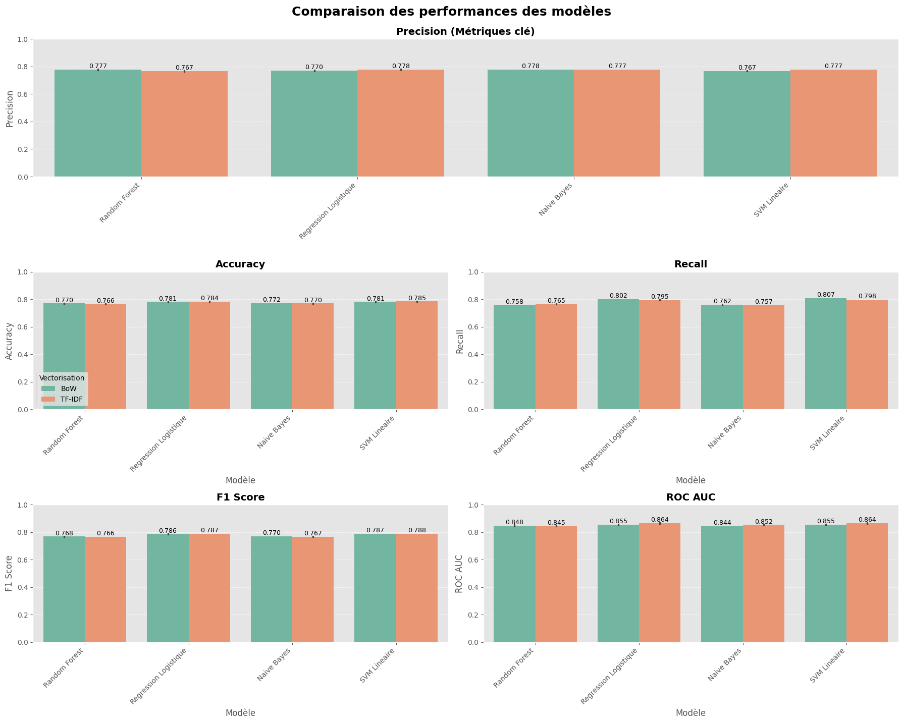

---

### 2. 🔥 Approche avancée : Word Embeddings + LSTM

Nous utilisons des vecteurs denses Word2Vec (entraînés) et GloVe 300d (préentraînés par Stanford), qui capturent les similarités sémantiques entre mots. Ces représentations ne prennent toutefois **pas en compte le contexte** exact (ex : "annulé" est probablement un mot très négatif pour un vol mais positif pour un procès contenant des charges contre vous).

La classification est réalisée par un **LSTM**, capable d'exploiter la séquentialité des mots.  
Le **modèle déployé est automatiquement sélectionné** entre Word2Vec + LSTM et GloVe + LSTM, selon la **précision maximale enregistrée dans MLFlow**.

Modèle `Word2Vec + LSTM` (`test_precision : 0.797 , val_precision : 0.795`):
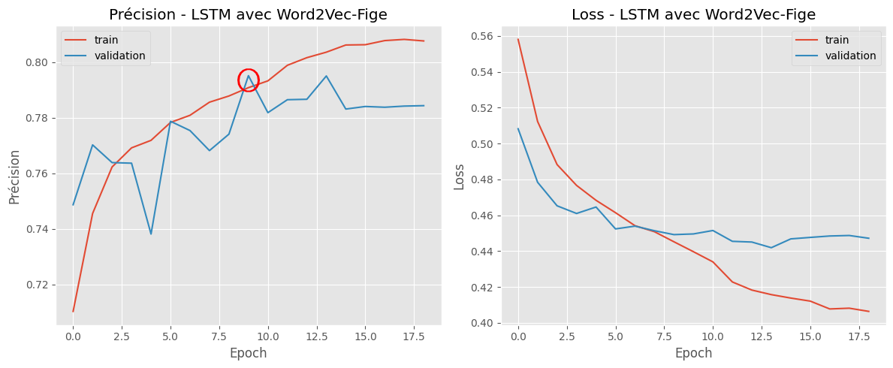
Modèle `GloVe 300d + LSTM` (`test_precision : 0.792 , val_precision : 0.798`):
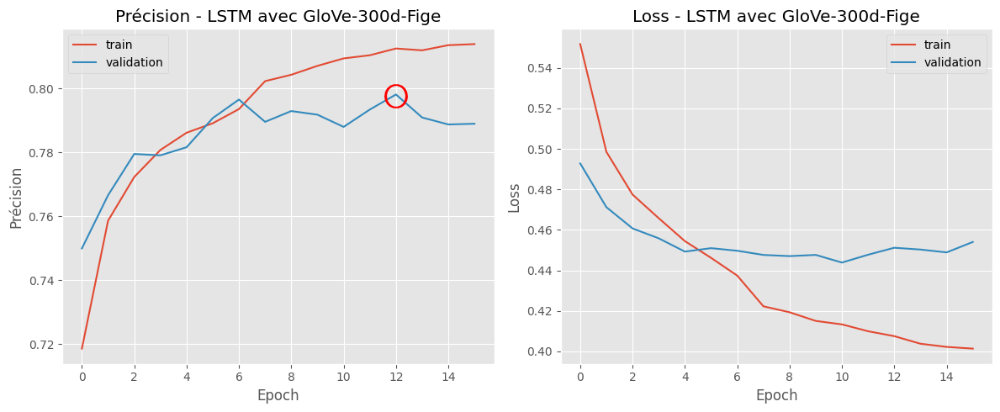

Bien que GloVe 300d + LSTM présente un score de précision légèrement supérieur à Word2Vec + LSTM sur l'ensemble de validation, il reste inférieur pour l'ensemble de test (relativement négligeable dans l'absolu).

---

### 3. 🤖 Approche transformer : DistilBERT, embeddings contextuels allégés

Nous avons utilisé **DistilBERT**, une version plus légère et plus rapide de BERT (créée par Hugging Face).  
Il conserve **95 % de la performance de BERT** tout en étant **40 % plus petit** et **60 % plus rapide**, ce qui le rend particulièrement adapté à un **entraînement sur GPU limité** (Google Colab) et à une **inférence plus rapide**.

Comme BERT, DistilBERT produit des **embeddings contextuels**, c’est-à-dire que le sens des mots varie selon leur contexte. Par exemple, *"banque"* dans *"je vais à la banque"* et *"banque de données"* n’aura pas le même vecteur.

Il a été **fine-tuné** ici pour une classification binaire (positif/négatif), avec un tokenizer et un encodage spécifiques à son architecture.

> **Modèle `DistilBERT`** (`test_precision : 0.861 , val_precision : 0.858`)

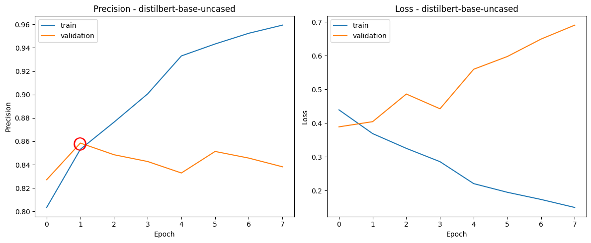  
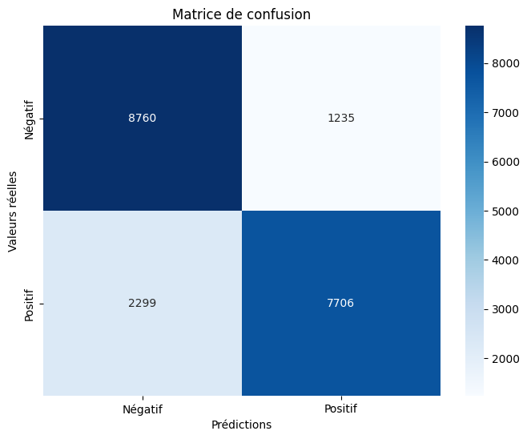  
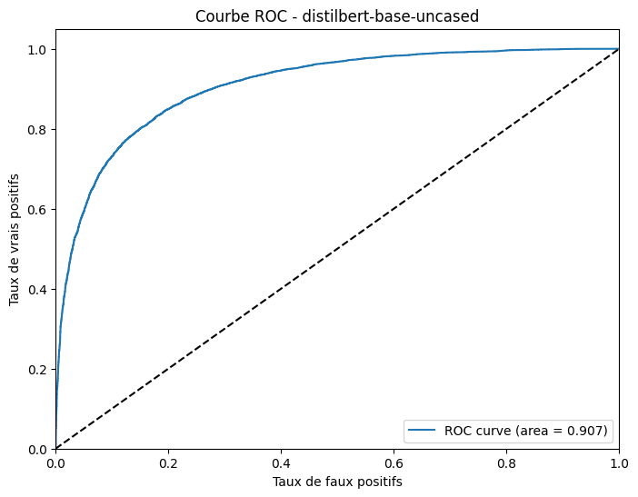

⚠️ **Limites** : comme tous les modèles préentraînés, DistilBERT **n’est pas sensible à l’ironie, aux jeux de mots, ni aux références culturelles implicites**.  
Or, Twitter est un terrain de jeu idéal pour ce genre de contenus détournés. Ces limites s’appliquent aussi à Word2Vec, GloVe et aux modèles classiques.

---

## 🎯 Pourquoi optimiser la précision (et non l'accuracy) ?

**Accuracy** = proportion de bonnes prédictions globales.  
**Precision** = proportion de tweets *prévus positifs* qui sont *vraiment positifs*.

> Exemple : sur 100 tweets, si le modèle prédit 30 positifs, mais 15 sont des erreurs, la précision est de 50 %.

Nous avons préféré **minimiser les faux positifs**, car dans un contexte sensible, **annoncer un tweet positif alors qu’il est négatif peut être problématique**.

- Modèles classiques : **GridSearchCV optimisé sur la précision**  
- Modèles DL : **EarlyStopping sur val_loss**, mais **sélection finale sur la précision**

---

## ⚙️ Environnement MLOps souverain

### 🖥️ Serveur personnel NAS + OpenMediaVault

MLFlow est installé sur un **NAS personnel (Intel N100)**, sous **OpenMediaVault (Debian)**.  
Nous utilisons **MinIO** pour stocker artefacts et modèles, garantissant une gestion locale, souveraine et compatible S3.

> Les notebooks, exécutés sur Google Colab pour bénéficier de GPU, loggent dans MLFlow et envoient les modèles vers MinIO via des **variables d’environnement**.

Dashboard Expériences MLFlow :
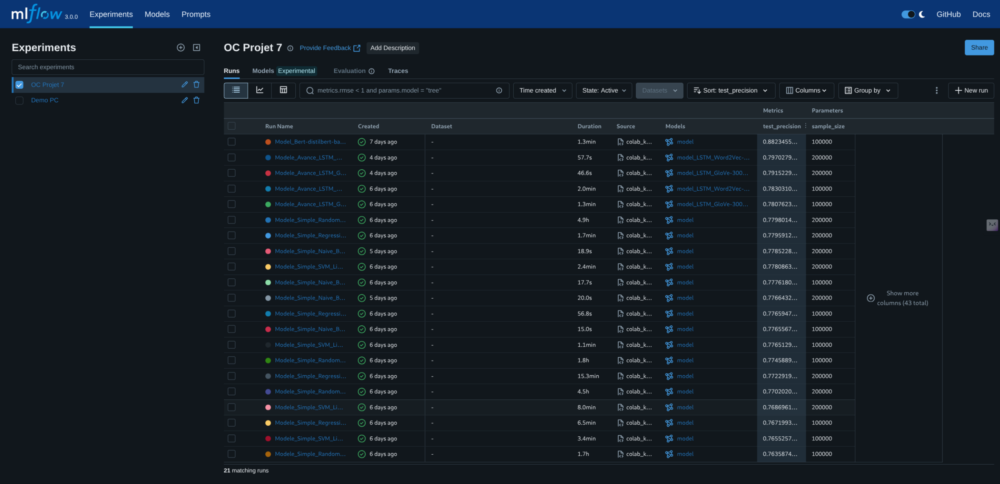

Modèles en production (registre de modèles):
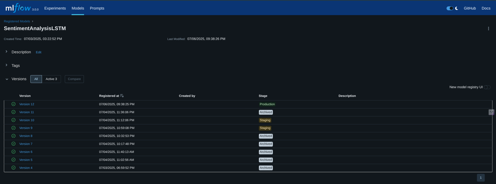

Meilleur modèle non BERT retenu :
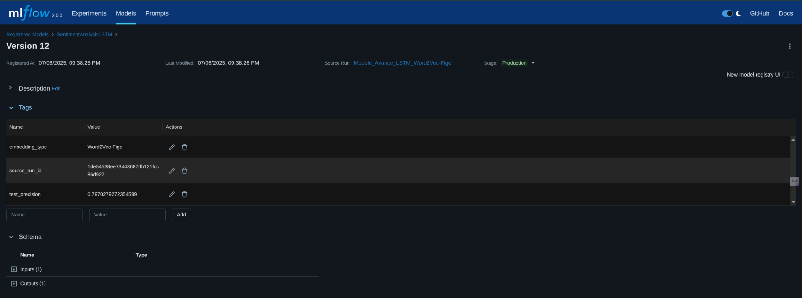
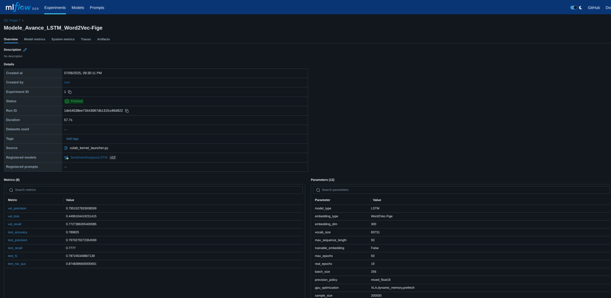
---

## 🧪 CI, tests et versioning

### ✅ Tests unitaires

- Vérifient le bon fonctionnement du prétraitement, des prédictions et de la gestion d’erreurs.
- Intégrés à **GitHub Actions**, **ils bloquent le déploiement si les tests échouent.**

### 🐳 Conteneurisation & CI/CD

L’API FastAPI est packagée via Docker, puis poussée sur DockerHub.  
Un pipeline CI/CD complet garantit **un déploiement reproductible**.

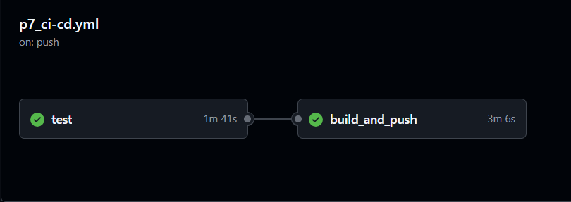
---

## 🚀 Déploiement de l’API FastAPI (double)

### 🔧 Backend : FastAPI

- Expose un endpoint `/predict`  
- Charge dynamiquement le **meilleur modèle Word Embedding + LSTM** via le *Model Registry* MLFlow  
- Applique les bons embeddings selon le tag `embedding_type`

### 💻 Interface Streamlit

Interface locale pour tester les requêtes, debug, démonstrations.

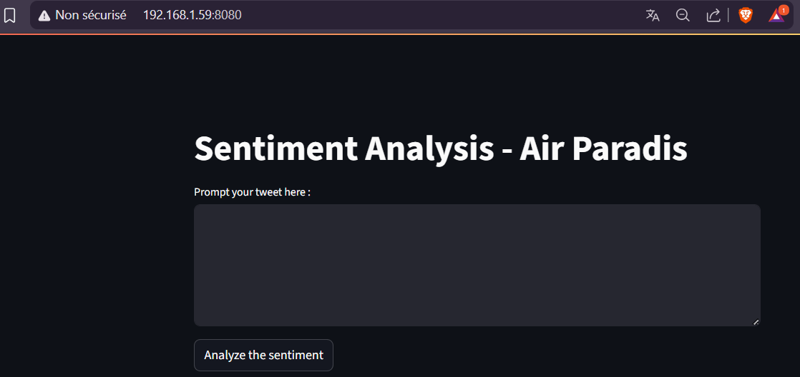

---

### 🌐 Double déploiement (NAS + Google Cloud)

#### 🔧 Problème AVX2

Initialement, l’API ne fonctionnait pas sur le NAS (Intel N100), faute d’instruction **AVX2**, requise par TensorFlow.

> 🛠️ **Solution : activer AVX2 dans le BIOS** (désactivée par défaut sur certaines cartes mères, souvent optimisées pour NAS).

Depuis, l’API tourne sur :
- 🏠 NAS local : [sentiment-api.greg-madman-nas.duckdns.org](https://sentiment-api.greg-madman-nas.duckdns.org)\
Interface Docker Compose de NAS:
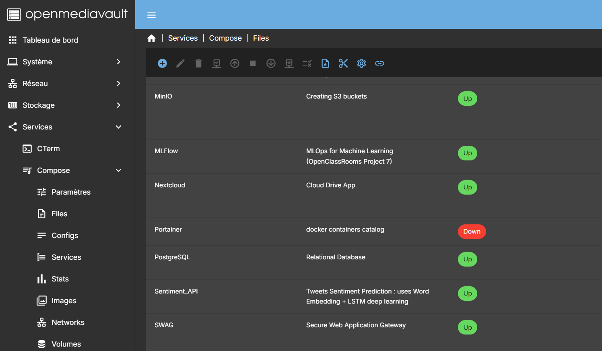

- ☁️ Google Cloud Run : [sentiment-api-service-7772256003.europe-west1.run.app](https://sentiment-api-service-7772256003.europe-west1.run.app)\
Interface Déploiement Google Cloud:
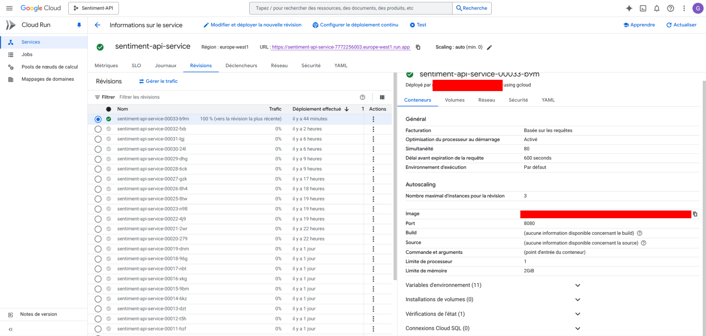

---

## 📊 Monitoring maison

Une logique d’alerte légère embarquée dans l’API :


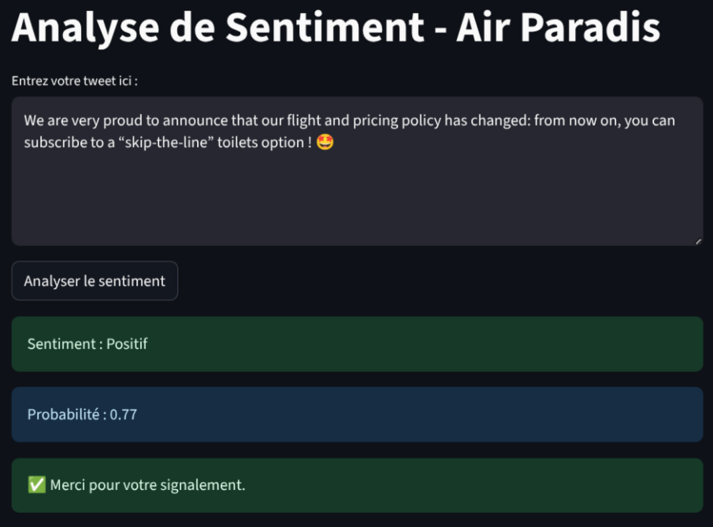

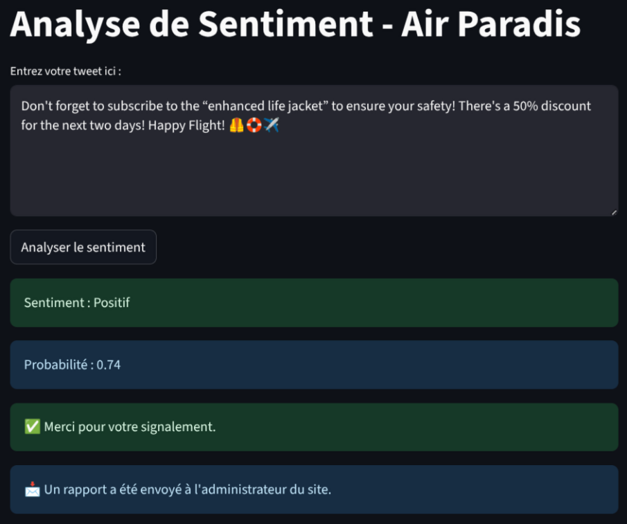


Si **3 erreurs de prédiction** consécutives sont détectées sur une **fenêtre de 5 min**, un rapport est généré automatiquement.

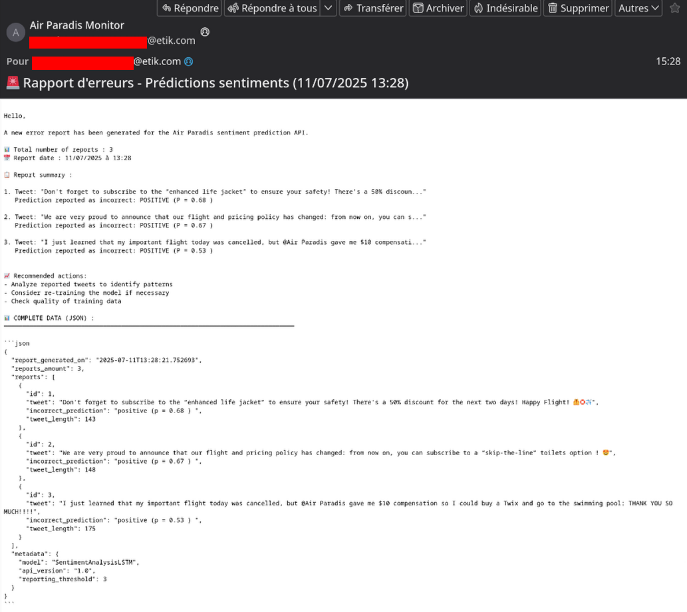


---

## 🧠 Schéma global du pipeline MLOps

```
     ┌────────────┐
     │  Données   │
     │ (tweets)   │
     └─────┬──────┘
           │
    Prétraitement (regex, tokenisation, lemmatisation, stopwords)
           │
 ┌─────────▼──────────┐
 │  Entraînement ML   │
 └─────────┬──────────┘
           │
    Log via MLFlow + artefacts MinIO
           │
 Sélection du meilleur modèle "avancé" (hors BERT) selon précision
           │
 ┌─────────▼──────────┐
 │    API FastAPI     │
 │    + Streamlit     │
 └─────────┬──────────┘
           │
 Déploiement sur NAS + Google Cloud Run
           │
┌──────────▼─────────────┐
│ Monitoring léger maison│
│ (alertes sur mauvaises │
│       prédictions)     │
└────────────────────────┘
```

---

## ✨ Conclusion

Ce projet démontre comment construire une chaîne MLOps complète, autonome et reproductible pour du NLP appliqué à Twitter.  
Il souligne les **forces et limites des modèles** (y compris BERT), la nécessité d’une métrique adaptée au contexte (précision vs accuracy), et l’importance d’un **déploiement maîtrisé**, même sur une infrastructure personnelle.

---

💬 Merci pour votre lecture !