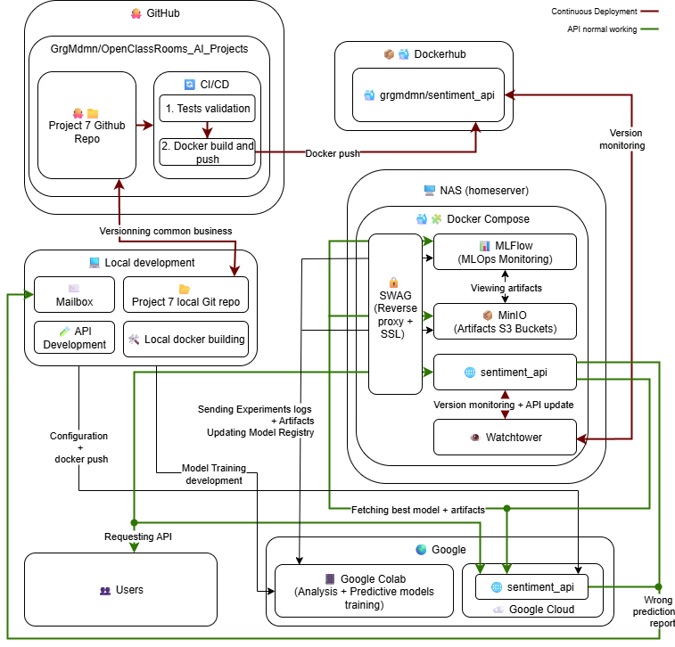

# ✨ Sentiment Analysis and MLOps Deployment: A Complete Experience Report

As part of the *Air Paradis* project, we implemented a full sentiment analysis pipeline from tweets, covering everything from modeling to MLOps deployment. This blog post reviews the key project stages: methodological choices, model comparison, deployment of a robust API, and deployment on two environments (local + cloud). 🧠🔧

---

## 🔍 Three Supervised Modeling Approaches

We tested three complementary approaches to predict the sentiment of a tweet. Each relies on a different text representation and a suitable learning algorithm:

### 1. 🧱 Simple Approach: Bag-of-Words (BoW) + Machine Learning Models

Tweets are vectorized using BoW or BoW + TF-IDF, which count word frequencies.  
Unlike other NLP projects, we avoided LDA (unsupervised, topic modeling oriented).

➡️ **Tested models**:
- Logistic Regression  
- Naive Bayes  
- SVM  
- Random Forest  

These models are trained with **GridSearchCV**, optimizing **precision (`precision`)**, our key business KPI. Various KPIs were computed on the test set.


---

### 2. 🔥 Advanced Approach: Word Embeddings + LSTM

We use dense Word2Vec vectors (trained) and GloVe 300d (pretrained by Stanford), which capture semantic similarities between words. However, these representations **do not take into account the exact context** (e.g., "cancelled" is probably very negative for a flight but positive in a legal case with charges against you).

Classification is done by an **LSTM**, capable of exploiting word sequentiality.  
The **deployed model is automatically selected** between Word2Vec + LSTM and GloVe + LSTM, according to the **highest precision recorded in MLFlow**.

Model `Word2Vec + LSTM` (`test_precision: 0.797, val_precision: 0.795`):  
  
Model `GloVe 300d + LSTM` (`test_precision: 0.792, val_precision: 0.798`):  


Although GloVe 300d + LSTM shows a slightly better precision score on the validation set than Word2Vec + LSTM, it remains lower on the test set (relatively negligible overall).

---

### 3. 🤖 Transformer Approach: DistilBERT, Lightweight Contextual Embeddings

We used **DistilBERT**, a lighter and faster version of BERT (created by Hugging Face).  
It retains **95% of BERT's performance** while being **40% smaller** and **60% faster**, making it especially suited for **training on limited GPUs** (Google Colab) and **faster inference**.

Like BERT, DistilBERT produces **contextual embeddings**, meaning word meanings vary depending on context. For example, *"bank"* in *"I go to the bank"* and *"database bank"* will not have the same vector.

It was **fine-tuned** here for binary classification (positive/negative), with a tokenizer and encoding specific to its architecture.

> **Model `DistilBERT`** (`test_precision: 0.861, val_precision: 0.858`)

  
  


⚠️ **Limits**: Like all pretrained models, DistilBERT **is not sensitive to irony, puns, or implicit cultural references**.  
Twitter is an ideal playground for this kind of nuanced content. These limits also apply to Word2Vec, GloVe, and classical models.

---

## 🎯 Why Optimize Precision (Not Accuracy)?

**Accuracy** = overall proportion of correct predictions.  
**Precision** = proportion of *predicted positive* tweets that are *actually positive*.

> Example: out of 100 tweets, if the model predicts 30 positives but 15 are wrong, precision is 50%.

We preferred to **minimize false positives**, because in a sensitive context, **announcing a tweet as positive when it is negative can be problematic**.

- Classical models: **GridSearchCV optimized for precision**  
- Deep Learning models: **EarlyStopping on val_loss**, but **final selection based on precision**

---

## ⚙️ Sovereign MLOps Environment

### 🖥️ Personal NAS Server + OpenMediaVault

MLFlow is installed on a **personal NAS (Intel N100)** running **OpenMediaVault (Debian)**.  
We use **MinIO** to store artifacts and models, ensuring local, sovereign, and S3-compatible management.

> Notebooks, run on Google Colab to leverage GPUs, log in MLFlow and send models to MinIO via **environment variables**.

MLFlow Experiments Dashboard:  


Production Models (model registry):  


Best non-BERT selected model:  
  


---

## 🧪 CI, Testing and Versioning

### ✅ Unit Tests

- Check correct preprocessing, predictions, and error handling.  
- Integrated into **GitHub Actions**, **blocking deployment if tests fail.**

### 🐳 Containerization & CI/CD

The FastAPI API is packaged with Docker, then pushed to DockerHub.  
A full [CI/CD pipeline](https://github.com/GrgMdmn/OpenClassrooms_AI_Projects/blob/main/.github/workflows/p7_ci-cd.yml) guarantees **reproducible deployment**, ensuring:  
- Validation of unit tests  
- Build and push of the containerized API to DockerHub


---

## 🚀 FastAPI API Deployment (Dual)

### 🔧 Backend: FastAPI

- Exposes a `/predict` endpoint  
- Dynamically loads the **best Word Embedding + LSTM model** via MLFlow Model Registry  
- Applies appropriate embeddings according to the `embedding_type` tag

### 💻 Streamlit Interface

Local interface for request testing, debugging, demonstrations.


---

### 🌐 Dual Deployment (NAS + Google Cloud)

#### 🔧 AVX2 Issue

Initially, the API did not run on the NAS (Intel N100 CPU) because it did not support **AVX2 instructions**, required by TensorFlow.

> 🛠️ **Solution**: manual activation of AVX2 support in BIOS. This option is often disabled by default on NAS motherboards for power consumption or stability reasons.

Since this change, the NAS can run the API without errors.

---

#### 🚀 Deployed APIs

The project offers a **dual API deployment**, locally and in the cloud:

- 🏠 **Local NAS**: [sentiment-api.greg-madman-nas.duckdns.org](https://sentiment-api.greg-madman-nas.duckdns.org)  
Docker Compose interface on the NAS:  


- ☁️ **Google Cloud Run**: [sentiment-api-service-7772256003.europe-west1.run.app](https://sentiment-api-service-7772256003.europe-west1.run.app)  
Google Cloud deployment interface:  


---

#### 🔄 Automated Continuous Deployment (NAS only)

To ensure **continuous deployment** on the NAS, we chose to install [**Watchtower**](https://containrrr.dev/watchtower/arguments/) to maintain a 100% `docker` environment. This tool checks every **10 minutes** the Docker image of the API (`sentiment_api`) and, if a new version is available on DockerHub, automatically restarts the container with the latest image.  


This mechanism ensures that the version deployed on the NAS always stays synchronized with the latest version validated by GitHub Actions tests, **without manual intervention**.  


An **email alert system** automatically notifies any update performed.  


---

## 📊 Home-made Monitoring

A lightweight alert logic embedded in the API:

  
  


If **3 consecutive prediction errors** are detected within a **5-minute window**, a report is automatically generated.


---

## 🧠 Overall MLOps Pipeline Diagram

### Summary Diagram

```
     ┌────────────┐
     │   Data     │
     │  (tweets)  │
     └─────┬──────┘
           │
  Preprocessing (regex, tokenization, lemmatization, stopwords)
           │
 ┌─────────▼──────────┐
 │   ML Training      │
 └─────────┬──────────┘
           │
  Logging via MLFlow + artifacts MinIO
           │
 Select best "advanced" model (excluding BERT) by precision
           │
 ┌─────────▼──────────┐
 │  FastAPI           │
 │  + Streamlit       │
 └─────────┬──────────┘
           │
 Deployment:
   ├─ Google Cloud Run (manual)
   └─ Local NAS (automated via Watchtower)
           │
┌──────────▼─────────────┐
│  Lightweight in-house  │
│     Monitoring         │
│   (alerts on bad       │
│     predictions)       │
└────────────────────────┘

```

### Detailed Diagram  


---

## ✨ Conclusion

This project demonstrates how to build a complete, autonomous, and reproducible MLOps pipeline for NLP applied to Twitter.  
It highlights the **strengths and limitations of the models** (including BERT), the need for a **metric adapted to the context** (precision vs accuracy), and the importance of **controlled deployment**, even on personal infrastructure.

---

💬 Thank you for reading!


Demander à ChatGPT
