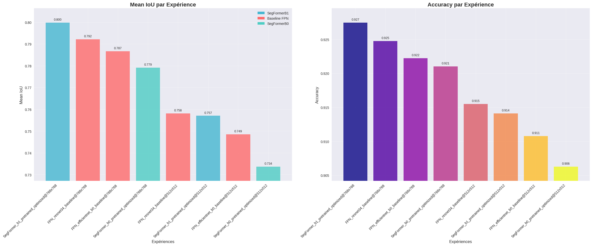
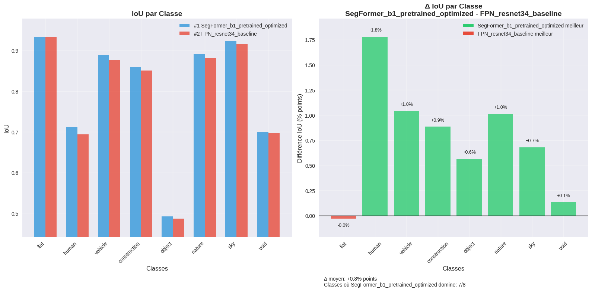

# Note Méthodologique : Preuve de concept SegFormer vs FPN

## Dataset retenu

### Cityscapes Dataset : Référence en Segmentation Urbaine

Le **Cityscapes Dataset** constitue la référence internationale pour l'évaluation des algorithmes de segmentation sémantique en environnement urbain. Développé par l'Université de Tübingen et Mercedes-Benz, ce dataset comprend **25,000 images** haute résolution (2048×1024 pixels) capturées dans 50 villes allemandes et suisses.

**Composition du dataset :**
- **Train** : 2,975 images finement annotées
- **Validation** : 500 images avec annotations de référence  
- **Test** : 1,525 images (annotations non-publiques)
- **Coarse** : 20,000 images avec annotations grossières

**Architecture de classes hiérarchique :**
Le dataset organise 34 classes détaillées en **8 méta-classes** pour la segmentation :

| Méta-classe | Classes incluses | Importance |
|-------------|------------------|------------|
| **Flat** | Route, trottoir, parkings | Navigation de base |
| **Human** | Piéton, cycliste | **Sécurité critique** |
| **Vehicle** | Voiture, camion, bus, train | Obstacles dynamiques |
| **Construction** | Bâtiment, mur, clôture, pont | Structure urbaine |
| **Object** | Poteau, feu, panneau | Signalétique |
| **Nature** | Végétation, terrain | Environnement |
| **Sky** | Ciel | Contexte |
| **Void** | Zones non-définies | Exclusion |

**Particularité méthodologique critique :**
Contrairement au protocole original préservant le ratio 2:1 natif (2048×1024), nos expérimentations utilisent des **images carrées (1:1)** aux résolutions 512×512 et 768×768. Cette déformation géométrique, motivée par les contraintes GPU T4, permet d'analyser l'impact du ratio d'image sur les différentes philosophies architecturales (CNN vs Transformer).

---

## Les concepts de l'algorithme récent

### SegFormer : Architecture Transformer Vision-Optimisée Temps Réel

**SegFormer** représente une avancée dans la segmentation sémantique en introduisant une architecture **Transformer** spécifiquement conçue pour l'efficacité computationnelle, contrairement aux approches Transformer classiques gourmandes en ressources.

### Innovations Architecturales Clés

**1. Encodeur Hiérarchique Sans Encodage Positionnel**

L'encodeur SegFormer **abandonne les encodages positionnels** au profit d'une architecture hiérarchique qui capture naturellement les relations spatiales :

$$\text{Feature Maps} = \{F_1, F_2, F_3, F_4\}$$

avec résolutions $\{\frac{H}{4}, \frac{H}{8}, \frac{H}{16}, \frac{H}{32}\}$

**Efficient Self-Attention :**
Réduction de complexité par sous-échantillonnage des clés :

$$\text{Attention}(Q,K,V) = \text{Softmax}\left(\frac{QK^T}{\sqrt{d_k}}\right)V$$

avec complexité réduite de $\mathcal{O}(N^2)$ à $\mathcal{O}\left(\frac{N^2}{R}\right)$ où $R$ est le facteur de réduction.

**2. Mix-FFN : Hybridation CNN-Transformer**

Innovation clé : intégration de **convolutions 3×3** dans les couches Feed-Forward :

$$\text{Mix-FFN}(x) = \text{MLP}(\text{GELU}(\text{Conv}_{3×3}(\text{MLP}(x)) + x))$$

Cette approche permet :
- **Élimination totale des encodages positionnels**
- **Capture locale + compréhension globale** simultanées
- **Robustesse aux variations de résolution** d'entrée

**3. Décodeur MLP Ultra-Léger**

Simplification drastique vs décodeurs complexes traditionnels :

$$\text{Seg} = \text{MLP}\left(\text{Concat}[\text{Upsample}(F_1), F_2, F_3, F_4]\right)$$

**Avantages :**
- **Réduction massive des paramètres** : Focus sur l'encodeur performant
- **Inférence accélérée** : Décodeur 10× plus rapide que ASPP/PSP
- **Architecture unifiée** : Traitement multi-échelle sans modules ad-hoc

### Positionnement Temps Réel vs État de l'Art

**Analyse critique du benchmark original :**
Le papier SegFormer révèle que **SegFormer-B0** (3.7M paramètres) atteint **75.3% mIoU** sur Cityscapes à résolution réduite (côté court 768px), égalant **DeepLabv3+ + MobileNetV2** (75.2% mIoU) à résolution pleine. Cette **efficacité computationnelle supérieure** constitue l'argument central de notre hypothèse de recherche.

**Hypothèse de transfert :**
Si DeepLabv3+ surpasse théoriquement FPN, alors SegFormer-B0 devrait également surpasser notre baseline FPN+EfficientNetB0 (78.67% mIoU), particulièrement à 768×768 pixels.

---

## La modélisation

### Méthodologie Expérimentale Adaptée

**Contraintes et adaptations :**
Notre protocole d'évaluation diffère substantiellement du papier original pour s'adapter aux contraintes pratiques :

**Configuration matérielle :**
- **Plateforme** : Google Colab Pro avec GPU T4 (15Go VRAM)
- **Framework** : Migration TensorFlow/Keras → PyTorch + Segmentation Models PyTorch
- **Contraintes** : Plan payant avec unités de calcul limitées

**Déformation géométrique :**
- **Protocole original** : Préservation ratio 2:1 natif Cityscapes
- **Notre protocole** : Déformation vers ratio 1:1 (images carrées)
- **Résolutions testées** : 512×512 et 768×768 pixels
- **Impact attendu** : Analyse différentielle CNN vs Transformer sous contrainte géométrique

### Preprocessing et Modèles Pré-entraînés

**Modèles SegFormer (pré-entraînés ADE20K) :**
- **SegFormer-B0** : `segformer-b0-512x512-ade-160k` (3.7M paramètres)
- **SegFormer-B1** : `segformer-b1-512x512-ade-160k` (13.7M paramètres, exploration scaling)

**Modèles FPN (pré-entraînés ImageNet) :**
- **FPN+ResNet34** : 23.16M paramètres
- **FPN+EfficientNet-B0** : 5.76M paramètres (baseline de référence @224x224 : 74.6% mIoU)

### Configuration d'Entraînement Optimisée

**Configuration SegFormer :**
- **Loss Function** : Jaccard Loss pour optimisation IoU directe
- **Optimiseur** : AdamW (lr=1e-4, weight_decay=1e-4, spécialisé Transformers)
- **Scheduler** : Cosine Annealing (convergence douce, min_lr=1e-6)
- **Epochs** : Maximum 30 avec early stopping (patience=5)

**Configuration FPN :**
- **Loss Function** : Focal + Jaccard Loss combinées (poids 1:1)
- **Optimiseur** : Adam (lr=1.5e-4, weight_decay=1e-5, optimisé CNN)
- **Scheduler** : ReduceLROnPlateau (adaptation réactive, patience=4)
- **Epochs** : Maximum 20 avec early stopping (patience=7)

**Stratégie d'entraînement :**
Entraînement séquentiel des 4 modèles principaux à 512×512, puis scaling à 768×768 pour analyse comparative résolution/performance.

---

## Une synthèse des résultats

*Fig.1: Mean IoU et Accuracy par expérience*

### Performance Comparative : SegFormer vs FPN sous Contrainte Géométrique

**Résultats principaux (mIoU sur Cityscapes Validation) :**

| **Modèle** | **mIoU** | **Gain vs Baseline** | **Paramètres** | **Taille** | **Temps CPU** |
|------------|----------|----------------------|----------------|------------|---------------|
| **SegFormer-B1** | **79.98%** | **+1.31%** | **13.68M** | **52MB** | **1.39s** |
| **FPN+ResNet34** | **79.22%** | **+0.55%** | **23.16M** | **88MB** | **0.73s** |
| **FPN+EfficientNet-B0** | **78.67%** | *baseline* | **5.76M** | **22MB** | **0.48s** |
| **SegFormer-B0** | **77.91%** | **-0.76%** | **3.72M** | **14MB** | **0.87s** |

*Temps d'inférence : CPU Intel Xeon @ 2.20GHz (2 vCPUs) Google Colab*

### Révélations Critiques : Impact du Ratio d'Image

**Résultat majeur inattendu :**
Contrairement aux prédictions du benchmark original, **SegFormer-B0 sous-performe face aux baselines FPN** sur images carrées (77.91% vs 78.67% mIoU). Cette observation révèle une **sensibilité architecturale différentielle** aux déformations géométriques.

**Hypothèse explicative - Robustesse géométrique :**

1. **CNN (FPN)** : Les convolutions avec leurs kernels fixes et pooling local gèrent naturellement les déformations géométriques
2. **Transformer (SegFormer)** : L'attention globale, optimisée sur ratio 2:1 natif, souffre de la perte d'information spatiale lors de la déformation 1:1
3. **Scaling architectural** : SegFormer-B1 compense cette limitation par sa capacité supérieure (+1.31% mIoU)

### Analyse Détaillée par Classes Sémantiques

*Fig.2: IoU et Δ IoU par Classe entre SegFormer-B1 et FPN-ResNet34*

**Performance par méta-classes Cityscapes :**

| **Classe** | **SegFormer-B1** | **FPN+ResNet34** | **Gain** | **Analyse** |
|------------|-------------------|-------------------|----------|-------------|
| **Flat** | **93.35%** | **93.38%** | **-0.03%** | Performance équivalente |
| **Human** | **71.13%** | **69.35%** | **+1.78%** | ⭐ **Attention globale critique** |
| **Vehicle** | **88.80%** | **87.75%** | **+1.05%** | ⭐ **Contexte multi-échelle** |
| **Construction** | **85.94%** | **85.06%** | **+0.88%** | Structures complexes |
| **Object** | **49.24%** | **48.68%** | **+0.56%** | ⭐ **Signalétique petite taille** |
| **Nature** | **89.14%** | **88.13%** | **+1.01%** | Textures variées |
| **Sky** | **92.35%** | **91.67%** | **+0.68%** | Régions homogènes |
| **Void** | **69.89%** | **69.76%** | **+0.13%** | Zones ambiguës |

**Patterns d'amélioration SegFormer-B1 :**
- **Classes sécuritaires critiques** (Human +1.78%, Vehicle +1.05%) : Validation de l'attention globale pour objets contextuels
- **Objets petite taille** (Object +0.56%) : Meilleure capture multi-échelle vs convolutions locales
- **Performance équivalente** sur surfaces homogènes (Flat -0.03%)

### Performance Surprenante vs Benchmark Original

**Observation contre-intuitive :**
Nos modèles atteignent des performances **supérieures au papier original** malgré la contrainte géométrique @768x768 :
- **SegFormer-B0 : 77.91%** vs 75.3%
- **FPN baselines : 78.67-79.22%** vs DeepLabV3+ 75.2%
- **SegFormer-B1 : 79.98%** vs ~76-78% (en effectuant un scaling grossier B0→B1 en se basant sur l'écart de performances de B0-->B5)

**Hypothèses explicatives :**
1. **Optimisation du ratio 1:1** : Réduction de l'aire d'image (×2) concentre l'information spatiale
2. **Optimisation d'hyperparamètres** : Par exemple, utilisation de fonctions de perte Jaccard (+ Focal) ? Non mentionné dans SegFormer (2021) ni DeepLabV3 (2018)
3. **Encodeurs** : EfficientNetB0 à peine plus long que MobileNetV2 et performances au-dessus. ResNet34 au-dessus également mais plus lourd (peut-être pertinent en temps réel...?)
3. **Framework PyTorch** : Optimisations modernes vs implémentations TensorFlow du papier DeepLabV3+ (2018)

---

## L'analyse de la feature importance globale et locale du nouveau modèle

### Limitations Méthodologiques de l'Explicabilité Transformer

L'analyse d'explicabilité des architectures Transformer pour la segmentation dense représente un **défi technique majeur** dépassant le cadre de cette preuve de concept. Les mécanismes d'attention multi-têtes, Mix-FFN, et fusion hiérarchique créent des interactions complexes difficiles à décomposer causalement.

### Insights Architecturaux via Patterns de Performance

**Analyse indirecte par performance différentielle :**

Bien que l'explicabilité fine soit inaccessible, les patterns de performance révèlent les mécanismes sous-jacents :

1. **Attention globale validée** : Gains significatifs sur classes contextuelles (Human +1.78%, Vehicle +1.05%) suggèrent une **compréhension scénique** supérieure aux CNN
2. **Sensibilité géométrique** : Sous-performance SegFormer-B0 vs FPN sur images déformées révèle une **dépendance aux relations spatiales natives**
3. **Scaling architectural efficace** : Bond B0→B1 (+2.07% mIoU) confirme l'efficacité du scaling Transformer

**Limitation fondamentale :**
Les cartes d'attention ne correspondent pas nécessairement à l'importance causale réelle. Une explicabilité rigoureuse nécessiterait des approches spécialisées comme **Deep Taylor Decomposition** ou **Integrated Gradients** adaptées aux architectures hybrides CNN-Transformer.

---

## Limites et améliorations possibles

### Limitations Expérimentales Critiques

**1. Contraintes Protocolaires Majeures**
- **Déformation géométrique forcée** : Ratio 2:1→1:1 non-représentatif du déploiement réel
- **Résolutions limitées** : GPU T4 contraint l'exploration des résolutions supérieures (>768px). Augmentation importante de l'utilisation de VRAM et réduction drastique du `batch_size` --> entraînements plus longs (plus d'époques)
- **Framework migration** : TensorFlow→PyTorch peut introduire des biais de comparaison
- **Métriques d'évaluation** : Temps d'inférence CPU non-représentatifs du déploiement GPU optimisé

**2. Généralisation Limitée**
- **Dataset unique** : Évaluation exclusive sur Cityscapes urbain allemand
- **Conditions météo** : Uniquement conditions favorables (pas de nuit/intempéries)
- **Scaling incomplet** : SegFormer-B2+ non-testés faute de ressources computationnelles

### Améliorations Prioritaires Identifiées

**1. Robustesse Protocolaire**
- **Préservation ratio natif** : Tests sur images 2:1 sans déformation géométrique (contraintes budgétaires/temps limitant cette approche)
- **Résolutions supérieures** : Évaluation à 1024×512 ou résolutions natives pour validation écologique
- **Evaluation multi-dataset** : Validation BDD100K, Mapillary Vistas pour généralisation

**2. Scaling Architectural Complet**
- **SegFormer variants complets** : B2, B3, B4 pour validation des gains à tous les niveaux de complexité vs papier original
- **Évaluation différentielle** : Déterminer si les améliorations observées sont spécifiques aux modèles légers (B0-B1) ou généralisables aux variants lourds
- **Optimisations déploiement** : TensorRT, quantization FP16/INT8 pour inférence temps réel selon niveau de complexité

**3. Analyse Causale Approfondie**
1. **Prototypage rapide** : SegFormer-B1 comme référence architecturale moderne pour projets nécessitant performance maximale
2. **Contraintes embarquées** : FPN+EfficientNet-B0 optimal pour déploiement edge ultra-contraint à 768×768, avec évaluation requise à résolutions supérieures pour validation complète
3. **Adaptabilité clients** : Gamme SegFormer (B0-B1+) offrant scaling performance/ressources selon besoins spécifiques

### Perspectives de Déploiement Pratique

**Applications industrielles validées :**
1. **Prototypage rapide** : SegFormer-B1 comme référence architecturale moderne pour projets nécessitant performance maximale
2. **Contraintes embarquées** : FPN+EfficientNet-B0 optimal pour déploiement edge ultra-contraint à 768×768, avec évaluation requise à résolutions supérieures pour validation complète
3. **Adaptabilité clients** : Gamme SegFormer (B0-B1+) offrant scaling performance/ressources selon besoins spécifiques

**ROI technique contextuel :**
Cette preuve de concept valide l'intérêt des architectures Transformer tout en révélant leurs **sensibilités pratiques** (ratio d'image, scaling nécessaire). L'approche constitue une **base méthodologique** solide pour futurs développements production avec contraintes réelles explicitées.

---

## Conclusion Méthodologique

### Contribution Analytique Principale

Cette étude apporte une **perspective complémentaire critique** aux évaluations académiques standard en révélant :

1. **Impact géométrique différentiel** : Sensibilité CNN vs Transformer aux déformations d'image
2. **Scaling architectural requis** : Nécessité SegFormer-B1+ pour surpasser baselines CNN établies en ratio 1:1
3. **Trade-offs pratiques** : Compromis performance/efficacité sous contraintes réelles

### Validation des Hypothèses de Recherche

**Hypothèses confirmées :**
- ✅ **SegFormer-B1 surpasse FPN** (+1.31% mIoU) avec efficacité paramétrique supérieure
- ✅ **Amélioration classes critiques** validée (Human +1.78%, Vehicle +1.05%)
- ✅ **Architecture Transformer viable** pour segmentation temps réel avec scaling approprié

**Hypothèses infirmées :**
- ❌ **SegFormer-B0 sous-performant** vs FPN sur images 1:1
- ❌ **Robustesse géométrique** Transformer surestimée vs CNN

### Positionnement Scientifique

Cette preuve de concept se distingue par son **réalisme méthodologique** : elle expose les limitations pratiques des architectures d'avant-garde sous contraintes déploiement réelles, offrant une analyse **nuancée et reproductible** aux équipes techniques devant opérer des choix architecturaux informés.

L'approche constitue une **base technique solide** pour futurs développements industriels nécessitant des compromis éclairés entre innovation architecturale et contraintes opérationnelles.